# 🐕 Sistema de Gestión - Peluquería Canina

Sistema de gestión desarrollado en Java para peluquerías caninas que permite administrar información de mascotas y sus propietarios de manera eficiente y sencilla.

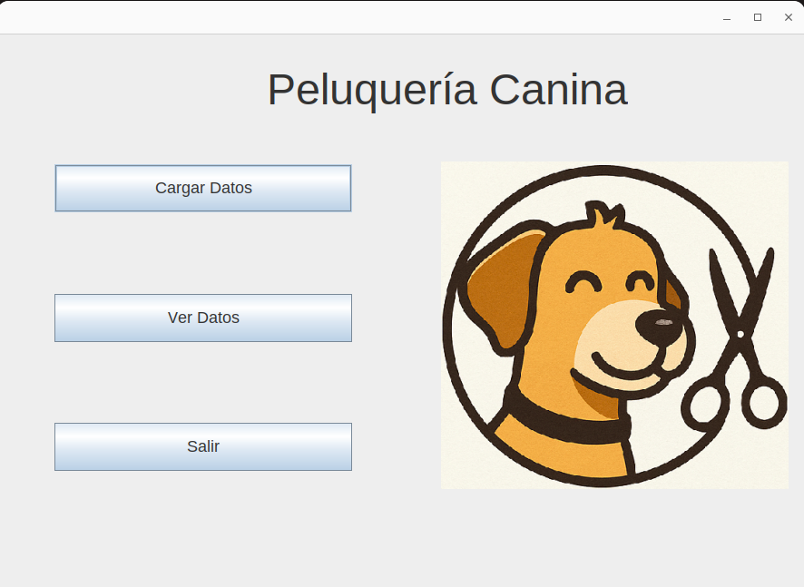

> **💡 Sistema Completo**: Desde registro con autocompletado hasta gestión inteligente de relaciones complejas entre dueños y mascotas

## 🔧 Funcionalidades Avanzadas Implementadas

### 🎯 Sistema de Validación Inteligente

```java
// Método para formato tipo título (Juan Pablo López)
private String convertirATitulo(String texto)

// Método para formato de oración (Golden retriever)
private String convertirAOracion(String texto)

// Búsqueda robusta en base de datos
public List<Duenio> buscarDuenioPorNombreYCelular(String nombre, String celular)
```

### 🚀 Características de Nivel Empresarial

- **Búsqueda inteligente en BD**: Queries con `TRIM()` y `UPPER()` que manejan variaciones de formato
- **Prevención proactiva de duplicados**: Sistema que detecta y reutiliza entidades existentes
- **Validación automática**: Aplicación consistente de formato en todos los formularios
- **Gestión de relaciones complejas**: Lógica sofisticada para cambios de dueños entre mascotas
- **Experiencia de usuario premium**: Autocompletado, validaciones y confirmaciones inteligentes

## 🔧 Funcionalidades Preparadas para Expansión

El proyecto incluye funcionalidades base preparadas para futuras mejoras:

- **`buscarDuenioPorNombre()`**: Búsqueda exacta de dueños (preparada para pantallas de administración)
- **Arquitectura escalable**: Diseñada para agregar nuevas funcionalidades sin refactoring
- **Base para reportes**: Estructura preparada para generar informes y analytics
- **Sistema de logging**: Infraestructura lista para auditoría y debugging avanzado

## 📝 Evolución del Proyecto

Este sistema comenzó como parte de mis estudios en **Programación Orientada a Objetos (POO) en Java**, pero evolucionó hacia una **demostración completa de desarrollo empresarial** que incluye:

- **Lógica de negocio compleja** con casos de uso reales y manejo de edge cases
- **Experiencia de usuario profesional** con interfaces intuitivas y validación automática
- **Arquitectura robusta** preparada para entornos de producción
- **Mejores prácticas de desarrollo** incluyendo seguridad, mantenibilidad y formato consistente de datos
- **Resolución de problemas reales**: Desde validación faltante hasta duplicados en BD y casos edge complejos

### 🏆 Hitos Técnicos Alcanzados

1. **Implementación de autocompletado avanzado** con `Timer` y `JPopupMenu`
2. **Lógica sofisticada de gestión de dueños** con múltiples mascotas
3. **Sistema robusto de validación** con métodos de formato profesional
4. **Búsquedas inteligentes en BD** que manejan variaciones de capitalización y espacios
5. **Prevención completa de duplicados** mediante reutilización inteligente de entidades
6. **Manejo de casos edge complejos** en cambios de relaciones entre dueños y mascotas### 🎯 Sistema de Validación Inteligente

```java
// Método para formato tipo título (Juan Pablo López)
private String convertirATitulo(String texto)

// Método para formato de oración (Golden retriever)
private String convertirAOracion(String texto)

// Búsqueda robusta en base de datos
public List<Duenio> buscarDuenioPorNombreYCelular(String nombre, String celular)
```

### 🚀 Características de Nivel Empresarial

- **Búsqueda inteligente en BD**: Queries con `TRIM()` y `UPPER()` que manejan variaciones de formato
- **Prevención proactiva de duplicados**: Sistema que detecta y reutiliza entidades existentes
- **Validación automática**: Aplicación consistente de formato en todos los formularios
- **Gestión de relaciones complejas**: Lógica sofisticada para cambios de dueños entre mascotas
- **Experiencia de usuario premium**: Autocompletado, validaciones y confirmaciones inteligentes

## 🔧 Funcionalidades Preparadas para Expansión

El proyecto incluye funcionalidades base preparadas para futuras mejoras:

- **`buscarDuenioPorNombre()`**: Búsqueda exacta de dueños (preparada para pantallas de administración)
- **Arquitectura escalable**: Diseñada para agregar nuevas funcionalidades sin refactoring
- **Base para reportes**: Estructura preparada para generar informes y analytics
- **Sistema de logging**: Infraestructura lista para auditoría y debugging avanzadola.

## 📋 Descripción del Proyecto

Esta aplicación de escritorio está diseñada para propietarios de peluquerías caninas que necesitan gestionar la información de sus clientes (mascotas y dueños). Proporciona una interfaz gráfica intuitiva para realizar operaciones CRUD (Crear, Leer, Actualizar, Eliminar) sobre los datos de manera rápida y eficiente.

### ✨ Funcionalidades Principales

- **Registro inteligente con autocompletado**: Formulario avanzado que sugiere dueños existentes mientras escribes, evitando duplicados y agilizando la carga
- **Gestión sofisticada de dueños compartidos**: Sistema inteligente que detecta cuando un dueño tiene múltiples mascotas y permite al usuario elegir entre:
  - Crear un nuevo dueño específico para esa mascota o reemplazarolo por otro existente
  - Modificar el dueño existente (afectando todas sus mascotas)
- **Visualización completa de datos**: Lista organizada con información detallada de mascotas y propietarios
- **Edición avanzada con detección de cambios**: El sistema detecta automáticamente modificaciones en datos del dueño y ofrece opciones inteligentes
- **Eliminación segura con confirmación**: Protección contra eliminaciones accidentales con diálogos de confirmación
- **Validación robusta de datos**: Sistema completo de formato y validación que incluye:
  - **Formato automático de nombres**: Capitalización inteligente (Juan Pablo López)
  - **Estandarización de datos**: Primer letra en mayúscula para razas, colores y observaciones
  - **Búsqueda inteligente**: Comparaciones insensibles a mayúsculas/minúsculas y espacios en blanco
  - **Prevención de duplicados**: Reutilización automática de dueños existentes incluso con variaciones de formato

## 🛠️ Tecnologías Utilizadas

- **Java**: Lenguaje de programación principal
- **Java Swing**: Interfaz gráfica de usuario (GUI) con componentes avanzados
- **Maven**: Gestión de dependencias y construcción del proyecto
- **MySQL**: Base de datos relacional
- **JPA (Java Persistence API)**: Capa de persistencia con consultas personalizadas
- **EclipseLink**: Proveedor de JPA para manejo de entidades
- **NetBeans**: IDE utilizado para el desarrollo (formularios .form incluidos)

## 🎯 Características Técnicas Destacadas

### 🧠 Lógica de Negocio Avanzada

- **Detección inteligente de cambios**: Comparación robusta de datos con manejo de `null` y espacios en blanco
- **Gestión de relaciones complejas**: Manejo sofisticado de dueños con múltiples mascotas
- **Prevención de duplicados**: Sistema que reutiliza dueños existentes cuando es apropiado
- **Validación de formato profesional**: Métodos `convertirATitulo()` y `convertirAOracion()` para estandarización de datos
- **Búsqueda robusta en BD**: Consultas con `TRIM()` y `UPPER()` para matching inteligente

### 🎨 Experiencia de Usuario (UX)

- **Autocompletado en tiempo real**: Sugerencias dinámicas con `Timer` y `JPopupMenu`
- **Diálogos de confirmación inteligentes**: El usuario siempre mantiene control sobre las decisiones críticas
- **Validación proactiva**: Feedback inmediato para prevenir errores de entrada
- **Consistencia visual**: Formato uniforme de datos en todas las pantallas
- **Manejo de casos edge**: Lógica refinada para escenarios complejos de cambio de dueños

### 🏗️ Arquitectura Profesional

- **Separación de capas**: Presentación, lógica de negocio y persistencia claramente definidas
- **Patrones de diseño**: Implementación de DAO, Factory y Observer patterns
- **Seguridad de credenciales**: Sistema de templates para proteger información sensible
- **Reutilización de código**: Métodos de validación compartidos entre formularios
- **Queries optimizadas**: Consultas SQL eficientes con funciones de cadena para matching robusto

## 📁 Estructura del Proyecto

```
src/
├── main/
│   ├── java/
│   │   └── com/mycompany/peluqueriacanina/
│   │       ├── PeluqueriaCanina.java          # Clase principal
│   │       ├── igu/                           # Interfaces Gráficas
│   │       │   ├── Principal.java             # Ventana principal
│   │       │   ├── CargaDatos.java            # Formulario de registro
│   │       │   ├── ModificarDatos.java        # Formulario de edición
│   │       │   └── VerDatos.java              # Visualización de datos
│   │       ├── logica/                        # Lógica de Negocio
│   │       │   ├── Controladora.java          # Controlador principal
│   │       │   ├── Mascota.java               # Entidad Mascota
│   │       │   └── Duenio.java                # Entidad Dueño
│   │       └── persistencia/                  # Capa de Persistencia
│   │           ├── ControladoraPersistencia.java
│   │           ├── MascotaJpaController.java
│   │           └── DuenioJpaController.java
│   └── resources/
│       ├── images/                            # Iconos y recursos gráficos
│       │   ├── editar.png                     # Icono botón editar
│       │   ├── eliminar.png                   # Icono botón eliminar
│       │   ├── guardr.png                     # Icono botón guardar
│       │   ├── limpiar.png                    # Icono botón limpiar
│       │   ├── volver.png                     # Icono botón volver
│       │   └── volverinicio.png              # Icono botón inicio
│       └── META-INF/
│           ├── persistence.example.xml        # Plantilla de configuración JPA
│           └── persistence.xml                # Configuración JPA (local, no incluido en Git)
├── docs/
│   └── screenshots/                           # Capturas de pantalla para documentación
│       ├── pantalla_incial.png               # Pantalla principal
│       ├── carda_datos.png                   # Formulario de carga
│       ├── visualizacion_datos.png           # Vista de datos
│       ├── mensaje_confirmar_cambios.png     # Diálogos de confirmación
│       ├── BD_dueños_antes_cambios.png       # Estado inicial BD
│       ├── BD_mascotas_post_cambios.png      # Estado final BD
│       ├── visualizacion_final.png           # Resultado final
│       └── confirmacion_eliminacion.png      # Confirmación de eliminación
└── pom.xml                                    # Configuración Maven
```

## 💡 Funcionalidad Destacada: Gestión Inteligente de Dueños

### 🔄 Flujo de Trabajo Avanzado

**Escenario**: Un dueño tiene múltiples mascotas y necesitas editar información de una sola.

1. **Detección Automática**: El sistema detecta automáticamente cambios en los datos del dueño
2. **Análisis de Impacto**: Verifica cuántas mascotas pertenecen al dueño modificado
3. **Decisión del Usuario**: Si el dueño tiene múltiples mascotas, presenta opciones claras:

   ```
   El dueño 'Juan Pérez' tiene 3 mascotas registradas.

   ¿Qué desea hacer?

   • SÍ: Crear/reemplazar un nuevo dueño solo para esta mascota
   • NO: Modificar el dueño existente (afectará todas sus mascotas)
   ```

4. **Ejecución Inteligente**:
   - **Opción SÍ**: Crea/reutiliza un dueño con los nuevos datos solo para esta mascota
   - **Opción NO**: Actualiza el dueño original (afecta todas sus mascotas)

### 🔍 Casos Edge Resueltos

**Escenario Complejo**: Marcos tiene mascotas Filipa y Marlot. Quieres cambiar Filipa para que pertenezca a Carla (quien ya existe en el sistema).

- **Problema anterior**: El sistema creaba un nuevo dueño "Carla" duplicado
- **Solución implementada**: Búsqueda inteligente con `TRIM()` y `UPPER()` que detecta el Carla existente y lo reutiliza
- **Resultado**: Filipa queda asignada al Carla original, Marcos mantiene solo a Marlot

### 🎯 Beneficios Empresariales

- **Flexibilidad**: Adapta el sistema a diferentes necesidades de negocio
- **Integridad de datos**: Previene inconsistencias y duplicados en la base de datos
- **Control total**: El usuario siempre decide qué acción tomar
- **Experiencia premium**: Interfaz que entiende y anticipa necesidades del usuario
- **Consistencia profesional**: Formato estandarizado automático en todos los datos

## ⚙️ Instalación y Configuración

### Prerrequisitos

- **Java JDK 17** o superior
- **Apache Maven 3.6+**
- **MySQL Server** (puede ser instalado a través de XAMPP)
- **IDE** (recomendado: NetBeans, IntelliJ IDEA, o Eclipse)

### Pasos de Instalación

1. **Clonar el repositorio**

   ```bash
   git clone https://github.com/CamilaVHeuer/Peluqueria-Canina-Java.git
   cd Peluqueria-Canina-Java
   ```

2. **Configurar la base de datos**

   - Iniciar XAMPP (o su servidor MySQL local)
   - Crear una base de datos llamada `peluqueria_canina`

   ```sql
   CREATE DATABASE peluqueria_canina;
   ```

3. **Configurar las credenciales de MySQL** 🔒

   **⚠️ IMPORTANTE - Seguridad de Credenciales:**

   Por seguridad, las credenciales reales de la base de datos NO están incluidas en el repositorio.

   - Copia el archivo de ejemplo: `src/main/resources/META-INF/persistence.example.xml`
   - Renómbralo como `persistence.xml` en la misma ubicación
   - Edita el nuevo archivo con tus credenciales reales:

   ```xml
   <property name="jakarta.persistence.jdbc.url" value="jdbc:mysql://localhost:3306/peluqueria_canina?serverTimezone=UTC"/>
   <property name="jakarta.persistence.jdbc.user" value="tu_usuario_mysql"/>
   <property name="jakarta.persistence.jdbc.password" value="tu_contraseña_mysql"/>
   ```

   **Nota**: El archivo `persistence.xml` está excluido del control de versiones por motivos de seguridad.

4. **Compilar el proyecto**

   ```bash
   mvn clean compile
   ```

5. **Ejecutar la aplicación**
   ```bash
   mvn exec:java -Dexec.mainClass="com.mycompany.peluqueriacanina.PeluqueriaCanina"
   ```

## 🚀 Uso de la Aplicación

1. **Ejecutar** la aplicación desde la clase principal
2. **Interfaz Principal**: Se abrirá la ventana principal con opciones de navegación
3. **Cargar Datos**: Utilizar el formulario para registrar nuevas mascotas y dueños
4. **Ver Datos**: Visualizar todos los registros en formato de tabla
5. **Editar**: Seleccionar un registro y modificar la información necesaria
6. **Eliminar**: Remover registros que ya no sean necesarios

## 📸 Capturas de Pantalla

### 🏠 Pantalla Principal

La interfaz principal ofrece navegación intuitiva hacia todas las funcionalidades del sistema.


### ➕ Formulario de Carga de Datos

Formulario avanzado con **autocompletado inteligente** que sugiere dueños existentes mientras escribes, evitando duplicados y agilizando la carga.

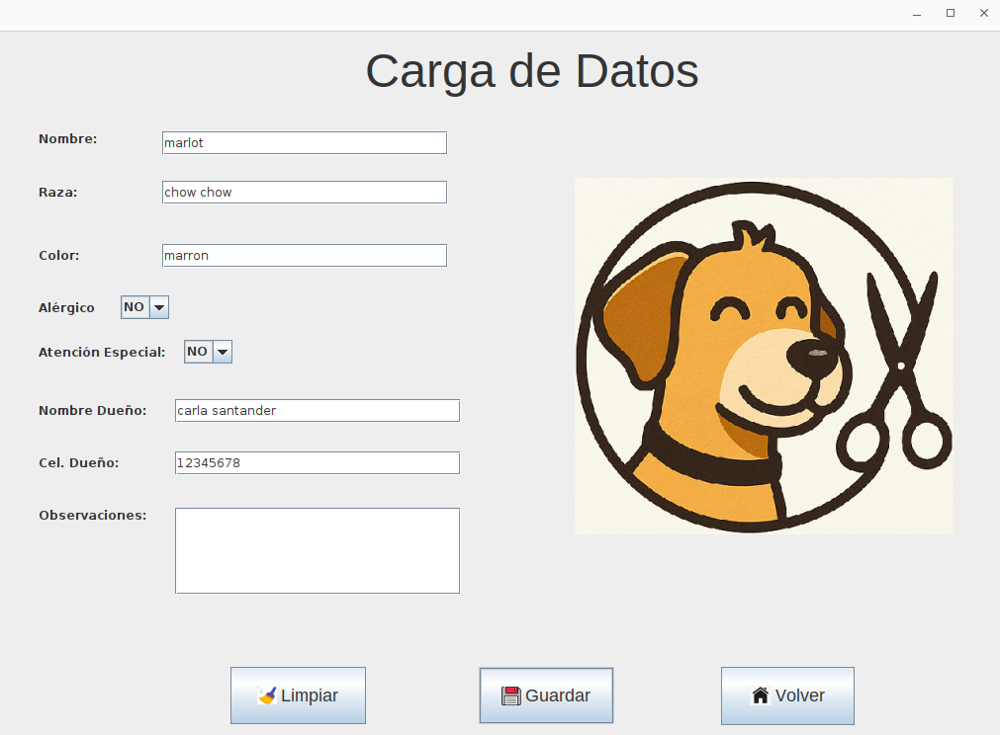

### 👁️ Visualización de Datos

Vista completa de todas las mascotas registradas con información detallada de sus dueños.

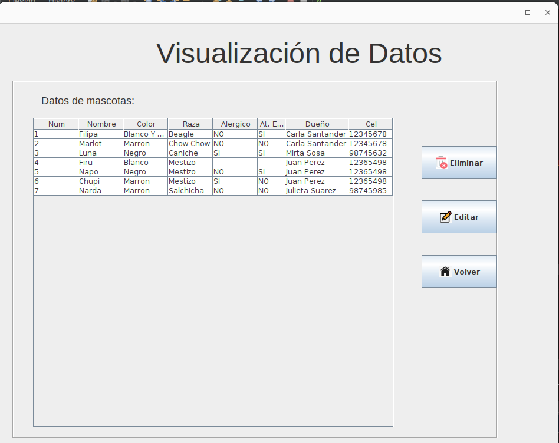

### 🔧 Gestión Inteligente de Dueños

El sistema detecta cuando un dueño tiene múltiples mascotas y ofrece opciones inteligentes al usuario.

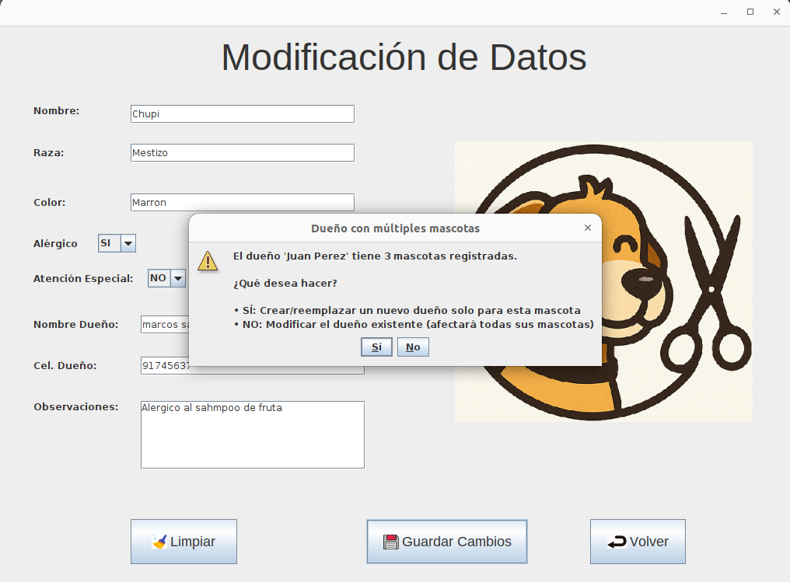

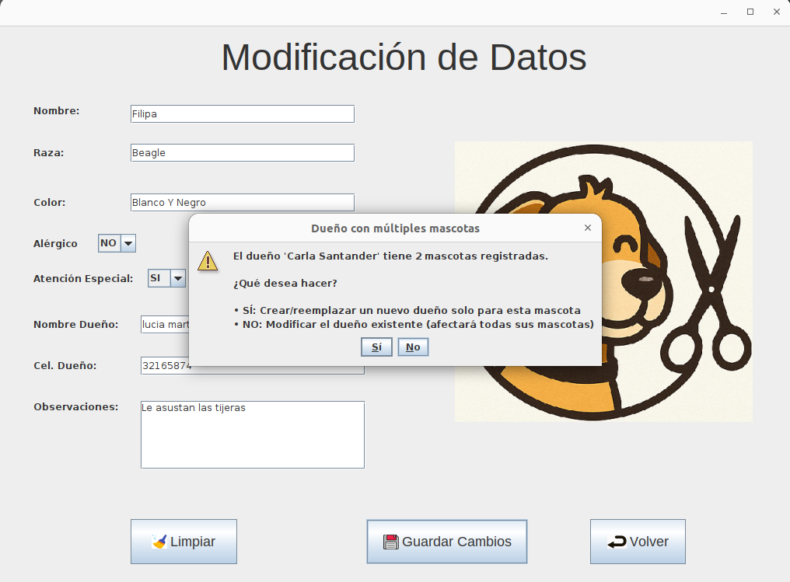

### 🔍 Demostración de Casos Edge - Base de Datos

**Estado Inicial**: Base de datos con dueños y mascotas antes de aplicar operaciones complejas.

**Configuración inicial de datos:**

- **Juan Pérez** (ID: 3) → Propietario de mascotas 4, 5 y 6
- **Carla Santander** (ID: 1) → Propietaria de mascotas 1 y 2

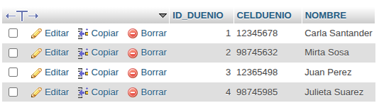

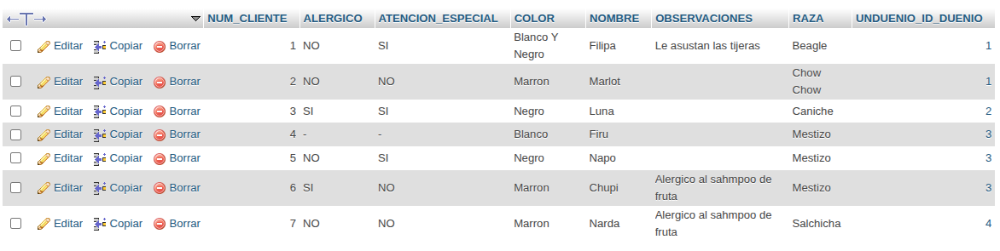

**Proceso de Transformación**: Aplicación de la lógica inteligente de gestión de dueños.

**Operaciones realizadas:**

- **Mascota 6**: Transferida de Juan Pérez → **Nuevo dueño** Marcos Sanabria (ID: 5)
- **Mascotas 4 y 5**: Permanecen con Juan Pérez (solo se modificó mascota 5)
- **Mascotas 1 y 2**: Reasignadas a Lucia Martínez

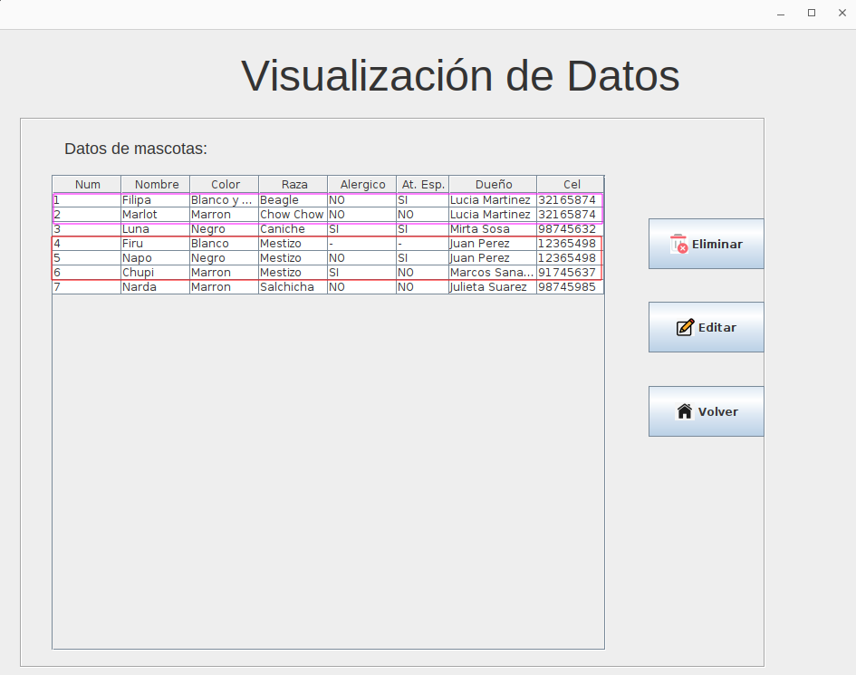

La base de datos refleja la **creación inteligente** del nuevo dueño Marcos Sanabria (ID: 5) específicamente para la mascota 6:

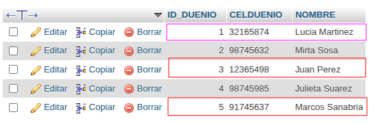

**Demostración de Reutilización**: Reversión del cambio para validar la lógica de reutilización.

Al reasignar la mascota 6 nuevamente a Juan Pérez, el sistema **reutiliza automáticamente** el dueño existente (ID: 3), demostrando la prevención inteligente de duplicados:

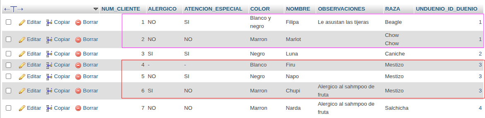

### 🎯 Visualización Final

Estado final de la aplicación mostrando los datos correctamente organizados tras las operaciones complejas.

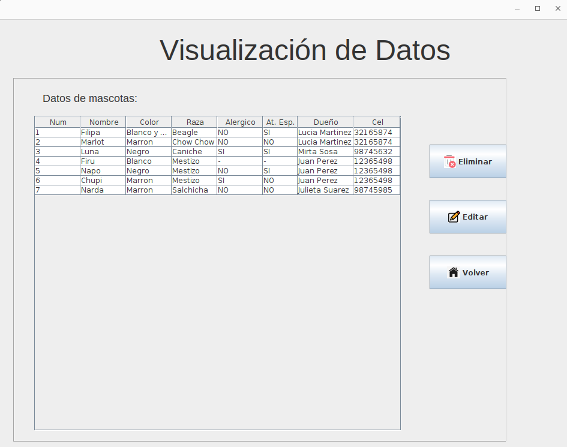

### 🗑️ Eliminación Segura

Confirmación antes de eliminar registros para prevenir eliminaciones accidentales.

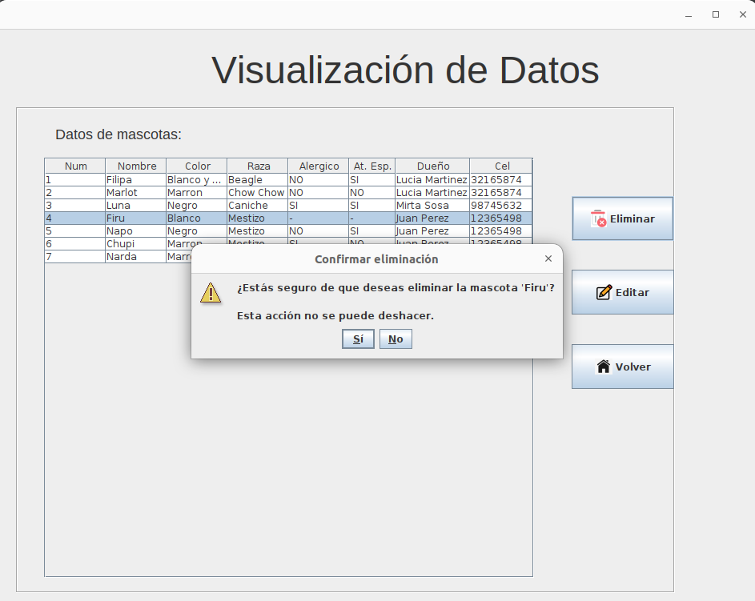

## 🔧 Configuración Adicional

- **Driver MySQL**: El proyecto incluye el driver MySQL Connector/J 8.0.33
- **JPA Schema Generation**: Configurado para crear automáticamente las tablas necesarias
- **Charset**: UTF-8 configurado para manejo correcto de caracteres especiales

## � Funcionalidades Preparadas para Expansión

El proyecto incluye funcionalidades base preparadas para futuras mejoras:

- **`buscarDuenioPorNombre()`**: Búsqueda exacta de dueños (preparada para pantallas de administración)
- **Arquitectura escalable**: Diseñada para agregar nuevas funcionalidades sin refactoring
- **Base para reportes**: Estructura preparada para generar informes y analytics
- **Sistema de logging**: Infraestructura lista para auditoría y debugging avanzado

## �📝 Origen del Proyecto

Este sistema comenzó como parte de mis estudios en **Programación Orientada a Objetos (POO) en Java**, pero evolucionó hacia una **demostración completa de desarrollo empresarial** que incluye:

- **Lógica de negocio compleja** con casos de uso reales
- **Experiencia de usuario profesional** con interfaces intuitivas
- **Arquitectura robusta** preparada para entornos de producción
- **Mejores prácticas de desarrollo** incluyendo seguridad y mantenibilidad

## 📞 Contacto

- **GitHub**: [CamilaVHeuer](https://github.com/CamilaVHeuer)
- **LinkedIn**: [Camila V. Heuer](https://www.linkedin.com/in/camilavheuer/)
- **Email**: cbvillalbaheuer@gmail.com

---

_Desarrollado con 💙 como parte de mi crecimiento profesional en desarrollo Java_

**Autor**: Camila V. Heuer
